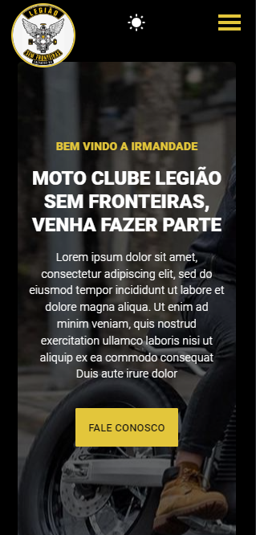
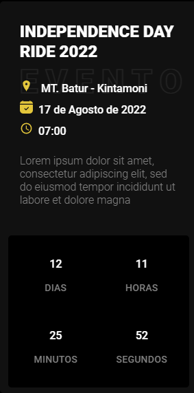
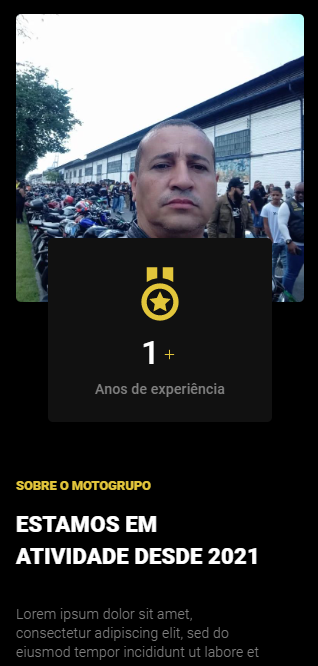
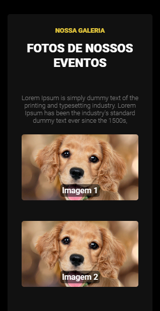
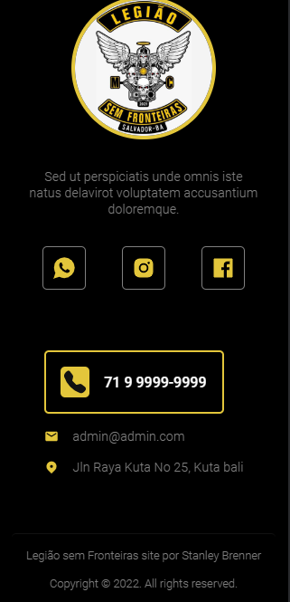
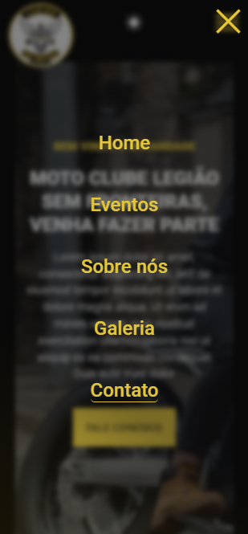
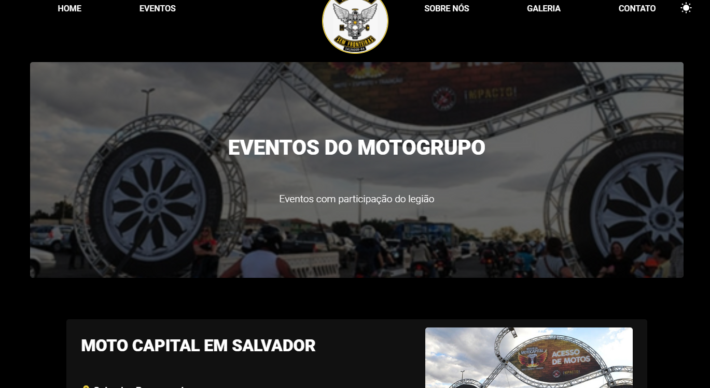
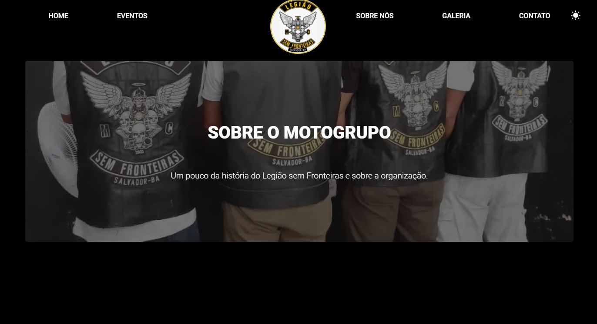

    </img>
    <h1>Legião sem Fronteiras</h1>
    
Site criado para o motogrupo Legião sem Fronteiras sem fins lucrativos

    <h1>Sobre o site!<h1>
    <ul style="display: flex; flex-direction: column; gap: 1rem; font-size: 1rem; list-style: none; margin-left: -3rem;">
        <li>🍃 O site foi feito inteiramente em ReactJS.</li>
        <li>🍃 O site foi feito com os conceitos de mobile first.</li>
        <li>🍃O site possui tema claro e escuro.</li>
        <li>🍃 Utilizei React Router para separar todas as páginas.</li>
        <li>🍃 Para estilização usei styled-components e um pouco de CSS.</li>
        <li>🍃 Além disso tem uso de react-icons, hooks, data-aos e etc.</li>
    </ul>

    <h1 style="font-size: 1.5rem">📷Fotos e Gifs do projeto</h1>
    <h3>Front-end mobile:</h3>
    

        </img>
        </img>
        </img>
        </img>
        </img>
        </img>
        </img>
        </img>
    

    <h3>Front-end desktop:</h3>
    

        </img>
        </img>
        </img>
    

    <h1>🖥️Tecnologias que usei:</h1>
    <ul>
        <li>React JS</li>
        <li>React Hooks</li>
        <li>React Icons</li>
        <li>React Router</li>
         
        <li>Styled Components</li>
        <li>CSS</li>
        <li>Prettier</li>
        <li>Data-AOS</li>
         
        <li>NodeJS</li>
        <li>NPM</li>
    </ul>

